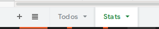
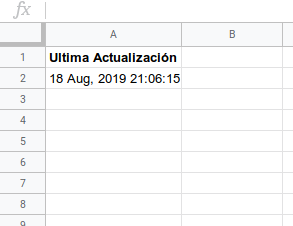

# Score Monster

Collect the scores of your hackerrank contests and store them in a google sheets.

## Special Thanks

Special thanks to [@mjjunemann](https://github.com/mjjunemann), [@fvr1](https://github.com/fvr1), and [@gnmonsalve](https://github.com/gnmonsalve) for doing the previous versions of this script, previously known as `score-collector` .

## Installation

Requirements: Python 3.6+, [`pipenv`](https://github.com/pypa/pipenv).

``` sh
git clone https://github.com/IIC1103/score-monster.git
cd score-monster

```

Install dependencies:

``` sh
    pip install -U pipenv
    pipenv install
    pipenv shell
```

## Basic Configuration

1. [Obtain OAuth2 credentials from Google Developers Console](https://gspread.readthedocs.io/en/latest/oauth2.html#using-signed-credentials). **Follow instructions of the site until Step 4.**

2. Rename the credentials to `credentials.json`

3. Create a spreadsheet in google sheets. Add a header to the spreadsheet.

4. Click the `Share` button and give edit access to the `client_email` located in your `credentials.json`

5. Optional: Add another tab named `Stats`

6. Create the `collect.json` file. This file contains all the information of contests and where to write them. More is explained below.

### The `collect.json` file

This file contains all the necessary information to collect the scores, and also where to write them. Here's an example

**`collect.json`**

``` json
{
    "sheets": [{
        "sheetUrl": "https://docs.google.com/spreadsheets/d/1B9rofhwH6beR7ApC8aJbomaeJ0Dwkemm9bDrGfHGeg-gY/edit#gid=1835467540",
        "tabName": "Todos",
        "showStats": true,
        "contests": [{
                "link": "iic1103-2019-2-lab1"
            },
            {
                "link": "tarea-1-iic1103",
                "startLimit": [2018, 12, 30, 20, 0],
                "endLimit": [2019, 8, 26, 20, 0]
            }
        ]
    }],
    "filter": [
        "hacker_1",
        "hacker_5",
        "hacker_17"
    ]
}

```

#### Structure

The first key should always be `sheets` .

* `sheets`

    A list of "sheet objects" where scores should be written. Inside each one you should specifiy the following items:

  * `sheetUrl` : The url to the spreadsheet where the specified contest scores will be written.

  * `tabName` : The name of the tab were scores will be written. Case sensitive. Based on the example above, the following picture shows two tabs on the spreadsheet: `Todos` which is the tab where scores will be written, and `Stats` which will be covered on the next item.

  

  * `showStats` (Optional): Indicates where stats (such as last updated) are shown in the `Stats` tab. So far, the only stat written is last updated, and it is always written on cell `A2` . An example of a `Stats` tab is shown below.

    

  * `contests` : An array of contests that will be written on this specific spreadsheet. Array contains "contest objects" as follows:

    * `link` : The part of the hackerrank link that takes you to the contest. For example, if the complete link is www.hackerrank.com/iic1103-2019-2-lab1, then the link would be `iic1103-2019-2-lab1`

    * `startLimit` (Optional): Sets a limit date from which scores will be considered. Any submission before that date is not considered. If this parameter is not given, any submission before `endLimit` is valid. The date should be passed as an array of 5 integers as follows: `[year, month, day, hour, minute]` .

    * `endLimit` (Optional): Sets a top limit date which scores will be considered. Any submission after that date is not considered. If this parameter is not given, any submission after `startLimit` is valid. The date should be passed as an array of 5 integers as follows: `[year, month, day, hour, minute]` .

* `filter` : An optional list of strings. Each string should represent a hacker's username. The script will collect only data from the specified hackers. Data from every hacker will be collected if this parameter is ommited or is left as an empty list.

## Usage

1. **Log in to Hackerrank either in firefox or chrome.** Really important! If you don't do this, the program will get stuck.
2. Simply run the two following lines:


``` sh
pipenv shell
python main.py
```

## Notes

- Contests inside `collect.json` must contain either a `startTime` **and** an `endTime`, only a `startTime` or neither. The script won't work if only an `endTime` is given.
